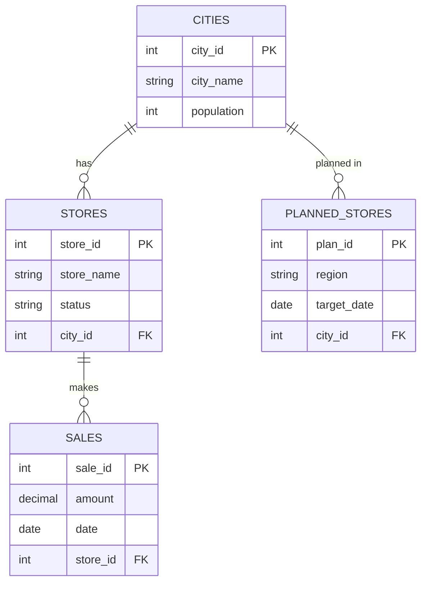

# Migros Decision Support System (DSS) - Backend API

A Node.js/Express REST API for the Migros Decision Support System that helps managers make data-driven decisions about opening new stores based on sales data, demographics, and regional analysis.

## 🏗️ Architecture

This project follows **strict MVC (Model-View-Controller)** architecture:

```
migros-dss-backend/
├── config/
│   └── db.js                 # Database connection pool
├── controllers/
│   ├── storeController.js    # Store business logic
│   ├── cityController.js     # City business logic
│   ├── salesController.js    # Sales business logic
│   └── plannedStoreController.js
├── models/
│   ├── StoreModel.js         # Store data access
│   ├── CityModel.js          # City data access
│   ├── SalesModel.js         # Sales data access
│   └── PlannedStoreModel.js  # Planned store data access
├── routes/
│   ├── storeRoutes.js        # Store endpoints
│   ├── cityRoutes.js         # City endpoints
│   ├── salesRoutes.js        # Sales endpoints
│   └── plannedStoreRoutes.js # Planned store endpoints
├── middlewares/
│   ├── errorHandler.js       # Centralized error handling
│   └── validator.js          # Request validation
├── database/
│   └── schema.sql            # Database schema
├── public/                   # Frontend files
├── server.js                 # Application entry point
├── .env.example              # Environment variables template
└── package.json
```

## 🚀 Tech Stack

- **Runtime:** Node.js
- **Framework:** Express.js
- **Database:** MySQL (with mysql2 driver)
- **Architecture:** MVC Pattern
- **API Standard:** RESTful

## 📦 Installation

1. **Clone the repository:**
   ```bash
   cd kds-proje-mehmet-efe-yildiz-main
   ```

2. **Install dependencies:**
   ```bash
   npm install
   ```

3. **Configure environment:**
   ```bash
   cp .env.example .env
   ```
   Edit `.env` with your database credentials:
   ```env
   DB_HOST=localhost
   DB_USER=root
   DB_PASSWORD=your_password
   DB_NAME=migros
   PORT=3000
   ```

4. **Setup database:**
   ```bash
   mysql -u root -p < database/schema.sql
   ```

5. **Start the server:**
   ```bash
   # Development mode with auto-reload
   npm run dev

   # Production mode
   npm start
   ```

6. **Verify it's running:**
   Navigate to `http://localhost:3000/api/health`

## 📚 API Endpoints

### 🏪 Stores API

| Method | Endpoint | Description |
|--------|----------|-------------|
| `GET` | `/api/stores` | Get all stores |
| `GET` | `/api/stores/:id` | Get store by ID |
| `GET` | `/api/stores/city/:cityId` | Get stores by city |
| `GET` | `/api/stores/status/:status` | Get stores by status (active/planned/closed) |
| `POST` | `/api/stores` | Create new store |
| `PUT` | `/api/stores/:id` | Update store |
| `DELETE` | `/api/stores/:id` | Delete store (⚠️ Business Rule 1 applies) |

**Business Rule 1:** Cannot delete a store if it has linked sales records.

**POST/PUT Request Body:**
```json
{
  "store_name": "Migros Jet Ankara 5",
  "city_id": 2,
  "status": "active"
}
```

### 🏙️ Cities API

| Method | Endpoint | Description |
|--------|----------|-------------|
| `GET` | `/api/cities` | Get all cities |
| `GET` | `/api/cities/:id` | Get city by ID |
| `POST` | `/api/cities` | Create new city |
| `PUT` | `/api/cities/:id` | Update city |
| `DELETE` | `/api/cities/:id` | Delete city |

**POST/PUT Request Body:**
```json
{
  "city_name": "İstanbul",
  "population": 15462452,
  "active_store_count": 45
}
```

### 💰 Sales API

| Method | Endpoint | Description |
|--------|----------|-------------|
| `GET` | `/api/sales` | Get all sales |
| `GET` | `/api/sales/:id` | Get sale by ID |
| `GET` | `/api/sales/store/:storeId` | Get sales by store |
| `GET` | `/api/sales/statistics` | Get sales statistics |
| `POST` | `/api/sales` | Create new sale |
| `PUT` | `/api/sales/:id` | Update sale |
| `DELETE` | `/api/sales/:id` | Delete sale |

**POST/PUT Request Body:**
```json
{
  "store_id": 1,
  "amount": 125000.50,
  "date": "2024-01-15"
}
```

### 📍 Planned Stores API

| Method | Endpoint | Description |
|--------|----------|-------------|
| `GET` | `/api/planned-stores` | Get all planned stores |
| `GET` | `/api/planned-stores/:id` | Get planned store by ID |
| `GET` | `/api/planned-stores/region/:region` | Get planned stores by region |
| `POST` | `/api/planned-stores` | Create new planned store (⚠️ Business Rule 2 applies) |
| `PUT` | `/api/planned-stores/:id` | Update planned store |
| `DELETE` | `/api/planned-stores/:id` | Delete planned store |

**Business Rule 2:** Cannot create a planned store if the target city's population is below 50,000.

**POST/PUT Request Body:**
```json
{
  "region": "Marmara Bölgesi",
  "target_opening_date": "2024-06-01",
  "city_id": 1
}
```

## 🎯 Business Rules Implementation

### Rule 1: Store Deletion Protection
**Location:** `controllers/storeController.js` - `deleteStore()` method

A store cannot be deleted if it has linked sales records. The API will return:
```json
{
  "success": false,
  "error": {
    "message": "Cannot delete store with existing sales records",
    "detail": "This store has linked sales data. Please remove all sales records before deleting the store."
  }
}
```

### Rule 2: Population Validation for Planned Stores
**Location:** `controllers/plannedStoreController.js` - `createPlannedStore()` method

A planned store cannot be created in a city with population below 50,000. The API will return:
```json
{
  "success": false,
  "error": {
    "message": "Population requirement not met",
    "detail": "Cannot create a planned store in [City Name]. The city population ([X]) is below the required minimum of 50,000."
  }
}
```

## 🧪 Testing the API

### Using cURL

**Get all stores:**
```bash
curl http://localhost:3000/api/stores
```

**Create a new store:**
```bash
curl -X POST http://localhost:3000/api/stores \
  -H "Content-Type: application/json" \
  -d '{"store_name":"Migros Test","city_id":1,"status":"active"}'
```

**Test Business Rule 1 (try to delete a store with sales):**
```bash
curl -X DELETE http://localhost:3000/api/stores/1
```

**Test Business Rule 2 (try to create planned store in small city):**
```bash
# First create a small city
curl -X POST http://localhost:3000/api/cities \
  -H "Content-Type: application/json" \
  -d '{"city_name":"Small Town","population":30000,"active_store_count":0}'

# Then try to create a planned store there (should fail)
curl -X POST http://localhost:3000/api/planned-stores \
  -H "Content-Type: application/json" \
  -d '{"region":"Test Region","target_opening_date":"2024-12-01","city_id":31}'
```

### Using Postman or Insomnia

1. Import the base URL: `http://localhost:3000`
2. Create requests for each endpoint listed above
3. Test all CRUD operations
4. Verify business rules are enforced

## 📊 Database Schema
The system uses 4 main tables:

1. **cities** - City information with population data
2. **stores** - Store information with status tracking
3. **sales** - Sales transaction records
4. **planned_stores** - Future store planning data


See `database/schema.sql` for complete schema with indexes and relationships.

## 🔧 Development

**Run in development mode:**
```bash
npm run dev
```

This uses `nodemon` to automatically restart the server when you make changes.

## 📝 API Response Format

**Success Response:**
```json
{
  "success": true,
  "data": { ... },
  "count": 10  // For list endpoints
}
```

**Error Response:**
```json
{
  "success": false,
  "error": {
    "message": "Error message",
    "detail": "Additional details"
  }
}
```

## 🛡️ Error Handling

All errors are handled by the centralized error handling middleware in `middlewares/errorHandler.js`. Validation errors return 400, not found errors return 404, and server errors return 500.

## 📄 License

ISC

## 👨‍💻 Author

University Assignment - Mehmet Efe Yıldız


